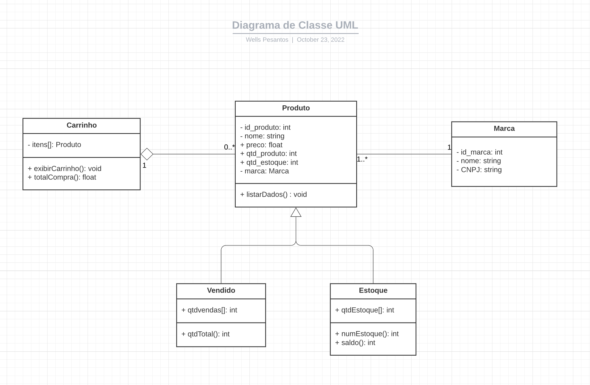

# Modelagem_Sistemas_PHP
Aplicando a Modelagem de Sistemas com PHP, seguindo o Diagrama de Classes e Objetos

<p align="center">
    
<p/>

<h3> Classe Produto </h3>

```php

<?php 

    class Produto {

        private $id_produto;
        private $nome;
        public $preco;
        public $qtd_produto;
        public $qtd_estoque;
        private $marca;
        
        ....
    }
?>

```

<h3> Classe Marca </h3>

```php

<?php 

    class Marca {

        private $id_marca;
        private $nome;
        private $CNPJ;
        
        ....
    }
?>

```

<h3> Classe Carrinho </h3>

```php

<?php 

<?php 

    class Carrinho {

        private $itens;

        function incluirItens(Produto $item) {

            $this->itens[] = $item;

        }

        function exibirCarrinho() {
            #code
        }

        function totalCompra() {
            #code
    }
  }
  
?>

```

